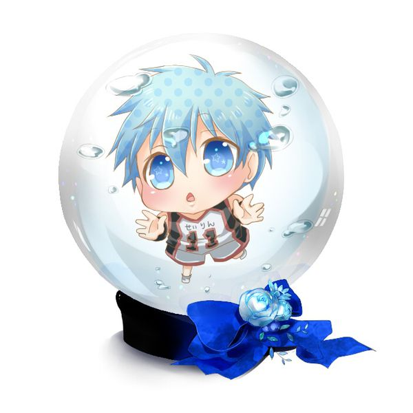
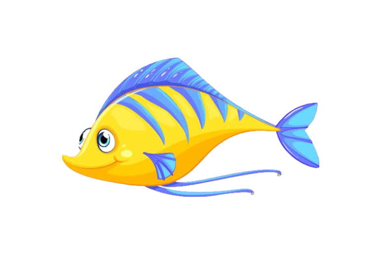
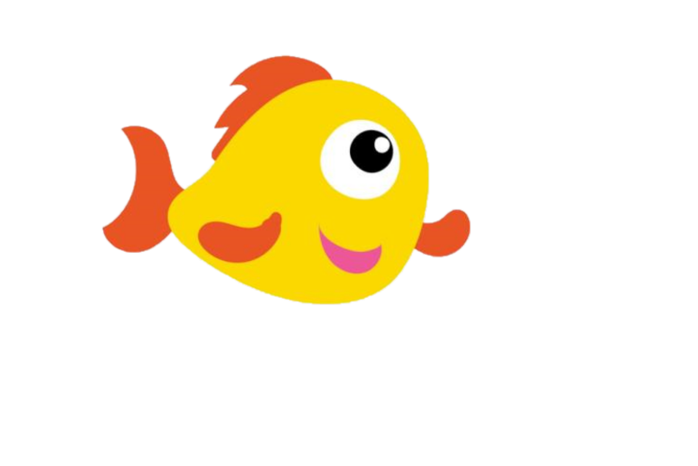
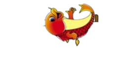
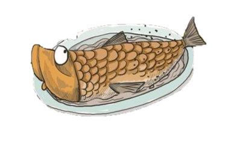
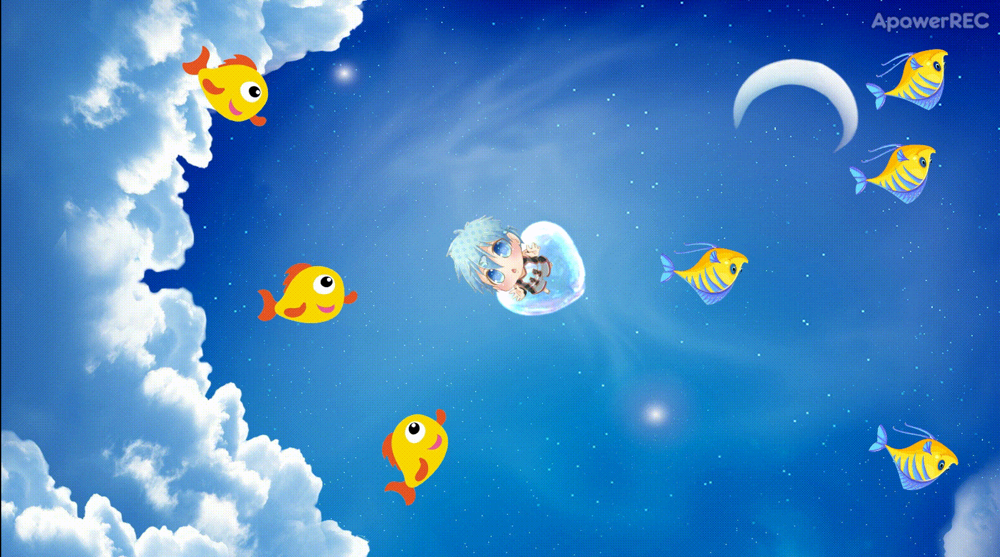

HTML5游戏设计与制作(进阶篇)
-----

**游戏策划：**

楔子(Setting)：在一片神秘漂亮的天空海洋里，有着许许多多生性淳朴的小鱼。有一个顽皮的小孩子名为多米，他的肚子十分的饿，但是他也不愿意将小鱼儿活活烤熟。所以他选择了运用爱去感化那些可爱的小鱼儿，让它们自愿奉献，在魔力中不受痛苦成为一条美味的烤鱼。但是小鱼儿也不愿意成为多米的食物，（除非它们中了多米的爱心魔法）所以它们希望能将顽皮的多米封印起来。

多米：能无限量发射爱心魔法，爱心魔法能将小鱼儿变成烤鱼。可以360旋转，行走速度较快。

小鱼儿：自由自在的生活天空海洋里，每过一秒便会有生成俩种不同的小鱼儿

**游戏开发小结**

Object:多米

Attribute:

由键盘的上下左右键控制行走

Collaborator：多米 Events & Actions：
碰撞小鱼儿&会被转换成被封印的状态

Object:被封印的多米

Attribute:

Collaborator：被封印的多米 events & Actions：不能行动，也不能发射爱心魔法

Object:爱心魔法

Attribute:

有多米发射，鼠标指向的位置

Collaborator：精灵 Events & Actions：碰撞 & 销毁自己

Object:小蓝鱼

Attribute:

向着多米的位置

Collaborator：小蓝鱼 Events & Actions：碰撞爱心魔法 & 变成烤鱼 

Object:小黄鱼

Attribute:

向着多米的位置

Collaborator：小黄鱼 Events & Actions：碰撞爱心魔法 & 变成烤鱼 

Object:烤鱼

Attribute:

向着多米的位置

Collaborator：烤鱼 Events & Actions：烤鱼会在1秒中褪色，消失

GIF小游戏：

