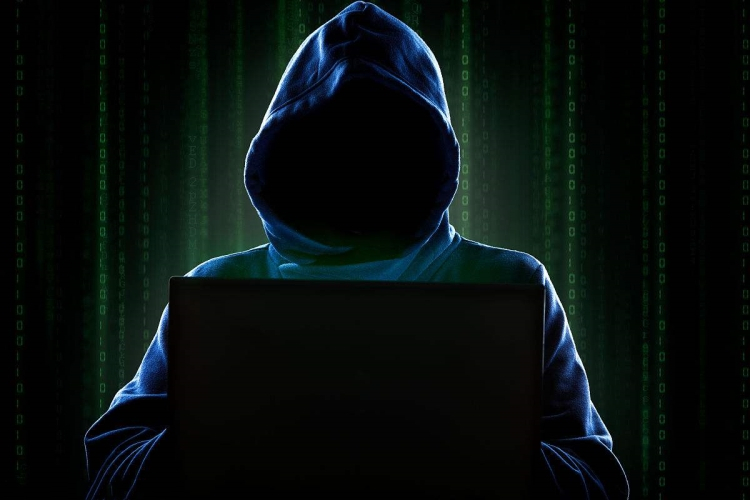
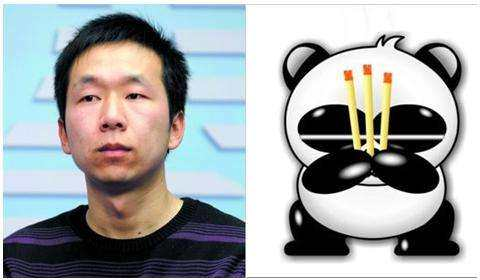
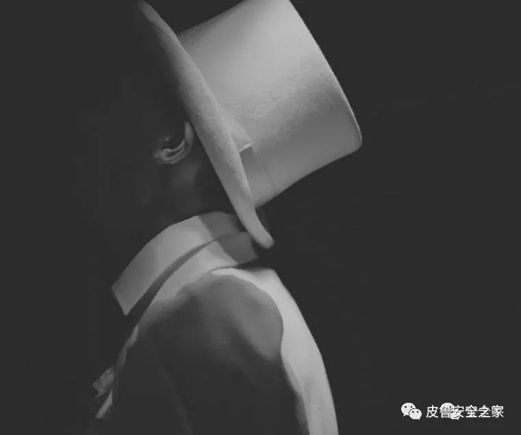

IT伦理与道德
-----
黑客之道

**作为一名计算机工作人员，我们需要遵循一些怎么样的道德准则与操守呢？**

网上有前辈如是说：
1. 第一，最重要是为人正直，忠于职守。人们常说：先做人，再做事。即使一个人，他的技术暂时还没有达到企业的要求。只有他拥有良好的品质，积极进取的心态，他也能在短时间内达到工作岗位的要求。
2. 严守商业秘密。目前在国内的IT行业，最可怕的其实并不是盗版问题，而是IT人才流失时技术（比如源代码，文档等等）也跟着一起流失，这是防不胜防的。就像心理医生为病人保守秘密一样，程序员也要为之前从事的项目保密。
3. 尊重别人的劳动。坚持支持正版，让其他同行的辛苦劳动得到回报。
4. 坚持顾客就是上帝。即使要推倒项目重新开始，也要给与顾客最好的服务。
5. 。。。

从小，黑客自带的神秘色彩就十分吸引我的眼球，也许许多小伙伴都曾立志做一个在互联网大海里遨游，技术高超的黑客。但是，那种即使有着高超的技术，却随随便便破坏他人劳动成果，罔顾他人经济利益真的是我们所向往的英雄吗？

接下来，让我们来看看一些有着罪恶行径的黑客。

世界第一黑客：凯文·米特尼克

天才在左，犯罪在右

原来，haiker在初期是一个具有褒义的词，不过，在凯文入侵了五角大楼、北美航空局、Sun系统公司、Novell电脑公司等一系列政府机构和著名的高科技大公司。

由于他利用计算机干了许多坏事，造成了许多损失，所以经常被强制邀请到美国FBI喝茶。

中国著名黑客：李俊

一个有禀赋却不被因学历不被社会认可的天才

百度百科：熊猫烧香是一系统备份工具GHOST的备份文件，使用户的系统备份文件丢失。被感染的用户系统中所有.exe可执行文件全部被改成熊猫举着三根香的模样。2006年10月16日由25岁的湖北武汉新洲区人李俊编写，2007年1月初肆虐网络，它主要通过下载的文件传染。2007年2月12日，湖北省公安厅宣布，李俊以及其同伙共8人已经落网，这是中国警方破获的首例计算机病毒大案。2014年，张顺、李俊被法院以开设赌场罪分别判处有期徒刑五年和三年，并分别处罚金20万元和8万元。

刘俊家境贫寒，父母都是水泥厂的工人，他没有就读高中，只是上了一所附属于水泥厂的技校。熊猫烧香只是他为了炫耀自己的名声，从而获得一份程序员工作而制造出来的软件。但是传说由于他并没有经过正式的程序员训练，惨遭许多公司的拒绝，这背后的是是非非，到底谁能解读呢？

以上所说全是黑帽黑客，也就是一些利用计算机技术，进行非法活动，蓄意破坏他人劳动成果的人。

其实还有一种白帽黑客的存在。

百度百科：白帽黑客是指白帽匿名者（white hat hacker），其又称为白帽子，是那些用自己的黑客技术来维护网络关系公平正义的黑客，测试网络和系统的性能来判定它们能够承受入侵的强弱程度。

在上文所说的第一位黑客：凯文，虽然他在年轻的时候利用技术做了不少毁坏黑客名声的事情，但是在2000年出狱后，他从此从良，成为一名顶级的电脑安全专家、顾问。

这个世界从不缺少天才，但是如果没有机会即使再有天分，就如李俊般，如果他能接受到良好的计算机教育，一份赫赫有名的学历，再加上他本身的天赋，他能不能成为一名顶级的计算机专家呢？
